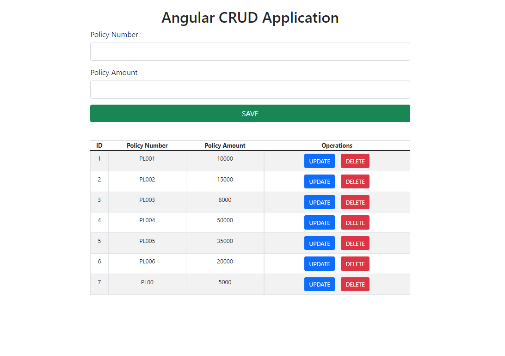

# CRUD Application

Basic CRUD Application using Angular 12, PHP and MySQL technologies

This project was generated with [Angular CLI](https://github.com/angular/angular-cli) version 12.2.9.

## Development server

Run `ng serve` for a dev server. Navigate to `http://localhost:4200/`. The app will automatically reload if you change any of the source files.

## Build

Run `ng build` to build the project. The build artifacts will be stored in the `dist/` directory.

## Steps To Configurate Project

1. Clone this project.
2. Put this project folder inside C:/xampp/htdocs (for this u need xampp to be installed on your system).
3. Create a database in PHPMyAdmin with the name crud_angular.
4. Import angulardb.sql in database crud_angular.
5. Finally put command npm install to install all dependencies.
6. Run the project ng serve --open
7. App will automatically open on `http://localhost:4200/` in your default Browser.

## Further help

To get more help on the Angular CLI use `ng help` or go check out the [Angular CLI Overview and Command Reference](https://angular.io/cli) page.

### Show some ❤️ by starring the repository!

